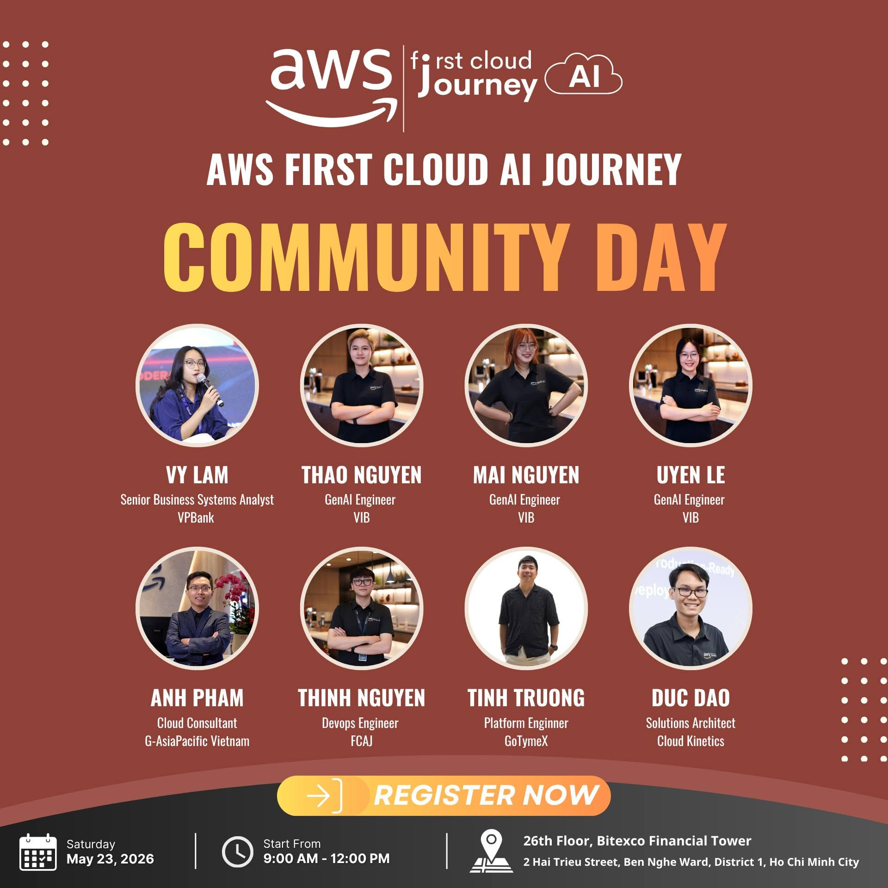

# Báo cáo tổng kết: AWS Community Day – AI Track

## Mục tiêu sự kiện

- Chia sẻ các xu hướng mới nhất trong AI và chiến lược triển khai thực tế
- Khám phá cách context, memory và agents đang định hình lại ngành công nghiệp AI
- Giới thiệu Amazon Q như một bộ công cụ AI nâng cao năng suất
- Chứng minh vai trò của CloudFront như nền tảng hạ tầng hiện đại
- Truyền cảm hứng cho sinh viên và lập trình viên bắt đầu xây dựng với AI

## Diễn giả

| Phiên | Diễn giả | Chức danh | Tổ chức |
|-------|----------|-----------|----------|
| Phiên 1 | Tinh Truong | Platform Engineer | GoTymeX |
| Phiên 2 | Duc Dao | Solutions Architect | Cloud Kinetics |
| Phiên 3 | Thinh Nguyen | DevOps Engineer | FCAJ |
| Phiên 4 | Thao Nguyen | GenAI Engineer | VIB |
| Phiên 4 | Mai Nguyen | GenAI Engineer | VIB |
| Phiên 4 | Uyen Le | GenAI Engineer | VIB |
| Phiên 5 | Anh Pham | Cloud Consultant | G-AsiaPacific Vietnam |
| Phiên 6 | Vy Lam | Senior Business Systems Analyst | VPBank |

## Nội dung nổi bật

- Insights thực tế về AI context, prompting và khái niệm Second AI Brain
- Trình diễn trực tiếp khả năng ngôn ngữ tự nhiên của Amazon Q trên dữ liệu và workflow
- Phân tích sâu CloudFront như một lớp bảo mật, hiệu suất và độ tin cậy
- Câu chuyện hackathon thực tế: xây dựng UTMorpho trong 36 giờ tại LotusHacks
- Thảo luận kỹ thuật về các hiểu lầm liên quan đến tính xác định của LLM và tối ưu hóa inference
- Kiến trúc multi-agent cấp enterprise cho bài toán chấm điểm tín dụng startup với guardrails tuân thủ

---

## Phiên 1: Context Is Everything – Making AI Actually Work for You

**🕘 09:00 – 09:30 SA**

### Các chủ đề được đề cập

- Tại sao AI thất bại khi thiếu context & "context" thực sự có ý nghĩa gì
- Từ prompts đến memory: cách AI đang phát triển (khái niệm Second AI Brain)
- Làm thế nào context tốt hơn dẫn đến kết quả tốt hơn (tư duy thực tế & mẹo hay)
- Career insights & cách sinh viên có thể bắt đầu xây dựng với AI + Q&A

### Bài học chính

- Context là nền tảng cho các giải pháp AI hiệu quả
- Hiểu rõ quá trình phát triển từ prompts đơn giản đến hệ thống memory ngữ cảnh
- Các chiến lược thực tế để triển khai context tốt hơn trong ứng dụng AI
- Cơ hội nghề nghiệp trong lĩnh vực AI và cách bắt đầu xây dựng giải pháp AI

---

## Phiên 2: Friendly AI Assistant with Amazon Q

**🕘 09:30 – 09:45 SA**

### Tổng quan

- **Amazon Q Chat Agent**: Trợ lý AI để khám phá dữ liệu, phân tích insights
- **Amazon Q Flows**: Tạo workflow thông minh bằng ngôn ngữ tự nhiên — không cần viết code
- **Amazon Q Spaces**: Không gian cộng tác chung biến individual insights thành team knowledge
- **Amazon Q Sight**: Xây dựng dashboards và reports từ dữ liệu thô bằng ngôn ngữ tự nhiên

### Bài học chính

- Amazon Q cung cấp bộ giải pháp toàn diện cho các workflow hỗ trợ AI
- Giao diện ngôn ngữ tự nhiên giúp người dùng không có kỹ thuật làm việc với dữ liệu
- Không gian cộng tác nâng cao việc chia sẻ kiến thức và insights trong team
- Cơ hội tự động hóa trong business intelligence và phân tích dữ liệu

---

## Phiên 3: From Edge To Origin – CloudFront as Your Foundation

**🕘 09:45 – 10:25 SA**

### Các chủ đề chính

- Amazon CloudFront cho mọi loại khối lượng công việc
- Tối ưu hóa chi phí với Amazon CloudFront
- Khả năng bảo mật
- Nâng cao độ tin cậy với Amazon CloudFront
- Nâng cao hiệu suất với Amazon CloudFront

### Bài học chính

- CloudFront là giải pháp đa năng cho các loại khối lượng công việc khác nhau
- Sử dụng CloudFront chiến lược giúp giảm chi phí đồng thời cải thiện hiệu suất
- Bảo mật và độ tin cậy được tích hợp sẵn thông qua phân phối edge
- Tối ưu hóa hiệu suất ở quy mô lớn bằng edge computing

---

## Phiên 4: 36 giờ tại LotusHacks – Building UTMorpho from Idea to Reality

**🕘 10:25 – 10:55 SA**

### Dàn bài thuyết trình

- Tại sao chúng tôi tham gia LotusHacks
- Từ Zero đến Idea – Hành trình Brainstorming
- Định nghĩa vấn đề & Định hình UTMorpho
- Xây dựng dưới áp lực – Sprint phát triển 36 giờ
- Thách thức, Thất bại & Turning Points
- UTMorpho – Tổng quan sản phẩm & platform_architecture
- Bài học rút ra & Hướng tiếp theo

### Bài học chính

- Rapid prototyping và iterative development dưới ràng buộc thời gian
- Tầm quan trọng của việc định nghĩa vấn đề và mục tiêu rõ ràng
- Học hỏi từ các thách thức và thất bại trong quá trình phát triển
- Insights thực tế cho việc tham gia hackathon và phát triển sản phẩm

---

## Phiên 5: Non-Determinism of "Deterministic" LLM Settings

**🕘 11:00 – 11:30 SA**

### Các khái niệm cốt lõi

- Cách LLM chọn token tiếp theo
- Giả định: Temperature=0 đảm bảo tính xác định
- Thực tế: Tối ưu hóa inference nói khác
- Tác động thực tế
- Các chiến lược giảm thiểu

### Bài học chính

- Các cài đặt LLM "xác định" không đảm bảo đầu ra xác định
- Hiểu rõ tối ưu hóa inference và ảnh hưởng đến tính nhất quán
- Các phương pháp thực tế để quản lý non-determinism trong hệ thống production
- Best practices cho các ứng dụng LLM đáng tin cậy

---

## Phiên 6: Enterprise-Grade Multi-Agent System – The Case of Startup Credit Scoring

**🕘 11:30 SA – 12:00 TR**

### Các chủ đề được đề cập

- Sự không phù hợp về cấu trúc giữa hệ thống ngân hàng và dữ liệu startup
- Single Agent: Khi nào nên và khi nào không nên dùng
- The Multi-Agent Paradigm
- Bản thiết kế của một Virtual Credit Committee
- Guardrails & Compliance
- Operational ROI & Implementation Roadmap

### Bài học chính

- Hệ thống multi-agent cung cấp giải pháp tinh vi cho các vấn đề kinh doanh phức tạp
- Hiểu khi nào nên dùng single agent so với multiple agents
- Compliance và guardrails là yếu tố thiết yếu trong các triển khai AI enterprise
- ROI có thể đo lường được thông qua tự động hóa thông minh và ra quyết định

---

## Trải nghiệm sự kiện & Bài học rút ra

Tham gia sự kiện này là một trải nghiệm vô cùng quý báu, giúp tôi tiếp cận với các công nghệ AI tiên tiến, ứng dụng thực tế và best practices của ngành. Những điểm nổi bật chính bao gồm:

### Các ứng dụng AI đa dạng

- Khám phá nhiều khía cạnh của AI: từ hiểu biết ngữ cảnh đến các hệ thống enterprise-grade
- Học cách các công ty triển khai AI trên nhiều lĩnh vực và use case khác nhau
- Hiểu sâu cả các khái niệm mới nổi (Second AI Brain, multi-agent systems) và các thực hành hiện có

### Insights triển khai thực tế

- Nhận thức rõ tầm quan trọng của context trong hiệu quả AI
- Khám phá các giao diện ngôn ngữ tự nhiên giúp dân chủ hóa truy cập dữ liệu
- Học về tối ưu hóa hiệu suất ở quy mô toàn cầu với CloudFront
- Hiểu các chiến lược quản lý non-determinism của LLM trong production

### Các case study thực tế

- Nghiên cứu use case startup credit scoring cho thấy cách triển khai AI ở enterprise
- Học hỏi từ kinh nghiệm hackathon với dự án UTMorpho
- Hiểu rõ sự cân bằng giữa đổi mới nhanh chóng và độ tin cậy trong production

### Phát triển sự nghiệp và kỹ năng

- Học cách sinh viên có thể bắt đầu xây dựng với AI
- Hiểu rõ nhiều con đường sự nghiệp trong lĩnh vực AI và cloud technologies
- Kiến thức thực tế có thể áp dụng vào các dự án tương lai

### Hình ảnh sự kiện

