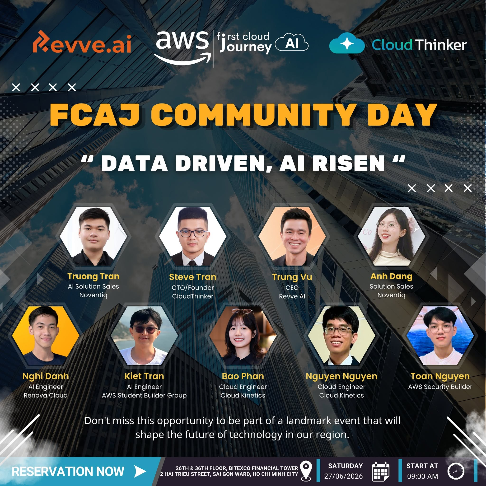

# Báo cáo tổng kết: FCAJ Community Day

## Mục Tiêu Sự Kiện

- Khám phá giải pháp phản ứng tự động và xử lý sự cố với Deep Response Engine.
- Tìm hiểu mẫu kiến trúc xây dựng Voice Agent AI giống người thật ở quy mô lớn với Amazon Nova Sonic.
- Khám phá AWS DevOps Agent và phương pháp suy luận đa tác nhân giúp giảm thiểu MTTD/MTTR.
- Hiểu cách ứng dụng AI trong lập kế hoạch nhân sự và chuyển đổi quản trị HR bằng Amazon Quick.
- Nắm vững cách xây dựng kết nối MCP (Model Context Protocol) riêng tư và bảo mật với Amazon Quick.

## Nội Dung Nổi Bật

- Tự động hóa xử lý sự cố, chuyển đổi từ hệ thống dựa trên cảnh báo (alert-driven) sang hệ thống dựa trên hành động (action-driven).
- Tương tác giọng nói AI độ trễ thấp dạng speech-to-speech với Amazon Nova Sonic & Bedrock.
- Suy luận đa tác nhân (multi-agent reasoning) cho vận hành hạ tầng trên môi trường hybrid và multi-cloud.
- Lập kế hoạch nhân sự chiến lược và tự động hóa quy trình HR cùng Amazon Quick.
- Hướng dẫn từng bước cấu hình kết nối VPC riêng tư cho các tích hợp MCP doanh nghiệp.

---

## Phiên 1: Deep Response Engine: From Detection to Autonomous Resolution

**Thời gian:** 09:00 - 09:25 AM

### Các chủ đề được đề cập

- Rào cản phức tạp trong vận hành đám mây hiện đại (The complexity wall in modern cloud operations).
- Chuyển dịch từ hệ thống cảnh báo sang hệ thống dựa trên hành động tự trị.
- Tổng quan kiến trúc Deep Response Engine.
- Live demo tự động phản ứng và xử lý sự cố.
- Tác động kinh doanh: giảm chi phí và vận hành không gián đoạn (zero-downtime).

---

## Phiên 2: Voice Agents: Building Human-Like AI Conversations at Scale

**Thời gian:** 09:25 - 09:55 AM

### Các chủ đề được đề cập

- Sự tiến hóa từ tổng đài IVR, chatbots đến các AI Voice Agents.
- Các thách thức cốt lõi: độ trễ (latency), độ chính xác và tương tác tự nhiên.
- Mô hình nền tảng speech-to-speech Amazon Nova Sonic.
- Kiến trúc giải pháp: Telephony, Streaming, Bedrock và các công cụ MCP.
- Case study doanh nghiệp, thực hành tốt nhất và live demo.

---

## Phiên 3: AWS DevOps Agent: Your Always-Available Operations Teammate

**Thời gian:** 09:55 - 10:20 AM

### Các chủ đề được đề cập

- Tổng quan về AWS DevOps Agent.
- Giảm chỉ số MTTD và MTTR nhờ vận hành hỗ trợ bởi AI.
- Hỗ trợ môi trường multi-cloud và hybrid cloud.
- Tiếp cận suy luận đa tác nhân (multi-agent reasoning) và Bedrock AgentCore.
- Case study thực tế và bài demo walkthrough trên ECS.

---

## Phiên 4: AI-Powered Productivity: Workforce Planning For Enterprise

**Thời gian:** 10:20 - 10:45 AM

### Các chủ đề được đề cập

- Thách thức chuyển đổi nhân sự (HR transformation) trong các doanh nghiệp hiện đại.
- Tổng quan về Amazon Quick và các tính năng hỗ trợ HR.
- Tăng tốc vận hành nhân sự bằng tự động hóa.
- Phân tích lực lượng lao động (workforce analytics) và hiểu biết từ dữ liệu.
- Lập kế hoạch nhân sự chiến lược cho việc ra quyết định của doanh nghiệp.

---

## Phiên 5: Building Secure Private MCP Connection with Amazon Quick

**Thời gian:** 10:45 - 11:30 AM

### Các chủ đề được đề cập

- Giới thiệu về Amazon Quick như một nền tảng trợ lý AI.
- MCP (Model Context Protocol) và vai trò mở rộng hệ thống.
- Các thách thức bảo mật trong tích hợp dựa trên MCP.
- Cấu hình kết nối VPC riêng tư cho Amazon Quick.
- platform_architecture thực tế và các góc nhìn triển khai trong môi trường doanh nghiệp.

---

## Trải nghiệm sự kiện & Bài học rút ra

Sự kiện **FCAJ Community Day** đã mang lại những góc nhìn kỹ thuật chuyên sâu về xử lý sự cố tự động, voice agent thời gian thực, trợ lý DevOps vận hành và hạ tầng MCP bảo mật.

### Bài học rút ra

- **Vận hành dựa trên hành động**: Chuyển đổi từ cảnh báo tĩnh sang hành động tự trị giúp giảm thiểu tối đa MTTR và tối ưu chi phí vận hành.
- **Voice Agent thế hệ mới**: Amazon Nova Sonic giúp hiện thực hóa các tương tác giọng nói độ trễ thấp, kết nối mượt mà với hệ thống tổng đài doanh nghiệp.
- **Bảo mật AI Doanh nghiệp**: Amazon Quick kết hợp cùng kết nối MCP riêng tư qua VPC giúp khai thác dữ liệu HR và công cụ nội bộ an toàn tuyệt đối.

### Hình ảnh sự kiện

